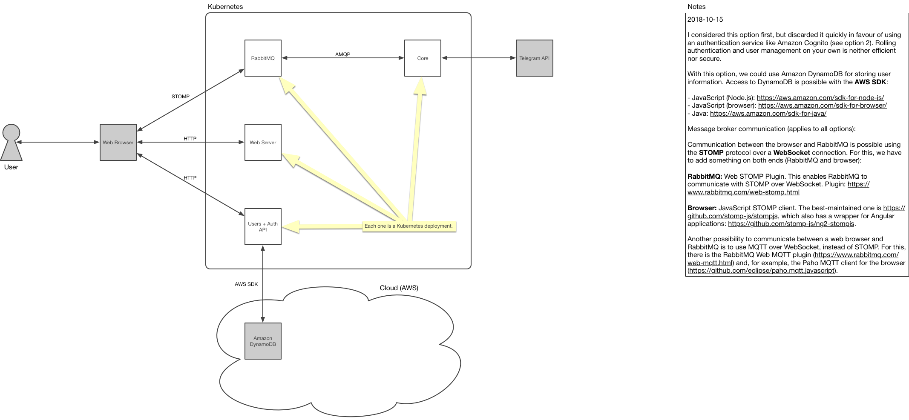
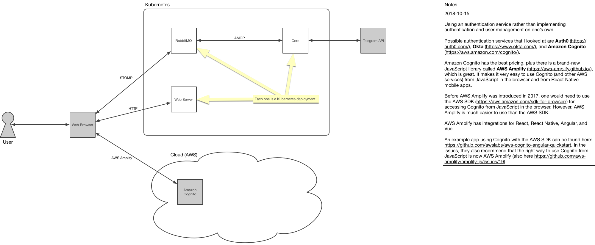
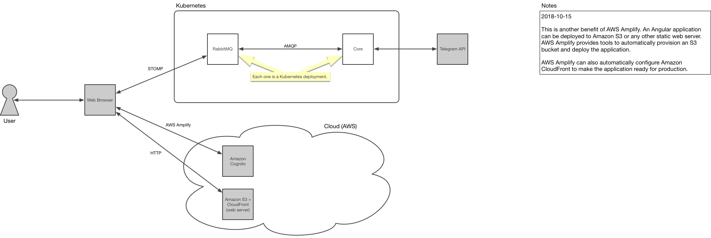
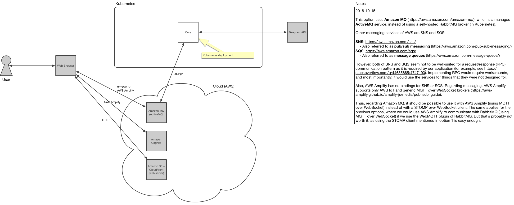

# Architecture during operation

## Option 1

## Option 2

## Option 3

## Option 4

## Notes

### Option 1

 considered this option first, but discarded it quickly in favour of using an authentication service like Amazon Cognito (see option 2). Rolling authentication and user management on your own is neither efficient nor secure.

With this option, we could use Amazon DynamoDB for storing user  information. Access to DynamoDB is possible with the AWS SDK:

- JavaScript (Node.js): https://aws.amazon.com/sdk-for-node-js/
- JavaScript (browser): https://aws.amazon.com/sdk-for-browser/
- Java: https://aws.amazon.com/sdk-for-java/

Message broker communication (applies to all options):

Communication between the browser and RabbitMQ is possible using the STOMP protocol over a WebSocket connection. For this, we have to add something on both ends (RabbitMQ and browser):

RabbitMQ: Web STOMP Plugin. This enables RabbitMQ to communicate with STOMP over WebSocket. Plugin: https://www.rabbitmq.com/web-stomp.html

Browser: JavaScript STOMP client. The best-maintained one is https://github.com/stomp-js/stompjs, which also has a wrapper for Angular applications: https://github.com/stomp-js/ng2-stompjs.

Another possibility to communicate between a web browser and RabbitMQ is to use MQTT over WebSocket, instead of STOMP. For this, there is the RabbitMQ Web MQTT plugin (https://www.rabbitmq.com/web-mqtt.html) and, for example, the Paho MQTT client for the browser (https://github.com/eclipse/paho.mqtt.javascript).

### Option 2

Using an authentication service rather than implementing authentication and user management on one’s own.

Possible authentication services that I looked at are Auth0 (https://auth0.com/), Okta (https://www.okta.com/), and Amazon Cognito (https://aws.amazon.com/cognito/).

Amazon Cognito has the best pricing, plus there is a brand-new JavaScript library called AWS Amplify (https://aws-amplify.github.io/), which is great. It makes it very easy to use Cognito (and other AWS services) from JavaScript in the browser and from React Native mobile apps.

Before AWS Amplify was introduced in 2017, one would need to use the AWS SDK (https://aws.amazon.com/sdk-for-browser/) for accessing Cognito from JavaScript in the browser. However, AWS Amplify is much easier to use than the AWS SDK.

AWS Amplify has integrations for React, React Native, Angular, and Vue.

An example app using Cognito with the AWS SDK can be found here: https://github.com/awslabs/aws-cognito-angular-quickstart. In the issues, they also recommend that the right way to use Cognito from JavaScript is now AWS Amplify (also here https://github.com/aws-amplify/amplify-js/issues/19).

### Option 3

This is another benefit of AWS Amplify. An Angular application can be deployed to Amazon S3 or any other static web server. AWS Amplify provides tools to automatically provision an S3 bucket and deploy the application.

AWS Amplify can also automatically configure Amazon CloudFront to make the application ready for production.

### Option 4

This option uses Amazon MQ (https://aws.amazon.com/amazon-mq/), which is a managed ActiveMQ service, instead of using a self-hosted RabbitMQ broker (in Kubernetes).

Other messaging services of AWS are SNS and SQS:

- SNS: https://aws.amazon.com/sns/
    - Also referred to as pub/sub messaging (https://aws.amazon.com/pub-sub-messaging/)
- SQS: https://aws.amazon.com/sqs/
    - Also referred to as message queues (https://aws.amazon.com/message-queue/)

However, both of SNS and SQS seem not to be well-suited for a request/response (RPC) communication pattern as it is required by our application (for example, see https://stackoverflow.com/q/44655685/4747193). Implementing RPC would require workarounds, and most importantly, it would use the services for things that they were not designed for.

Also, AWS Amplify has no bindings for SNS or SQS. Regarding messaging, AWS Amplify supports only AWS IoT and generic MQTT over WebSocket brokers (https://aws-amplify.github.io/amplify-js/media/pub_sub_guide).

Thus, regarding Amazon MQ, it should be possible to use it with AWS Amplify (using MQTT over WebSocket) instead of with a STOMP over WebSocket client. The same applies for the previous options, where we could use AWS Amplify to communicate with RabbitMQ (using MQTT over WebSocket) if we use the WebMQTT plugin of RabbitMQ. But that’s probably not worth it, as using the STOMP client mentioned in option 1 is easy enough.

